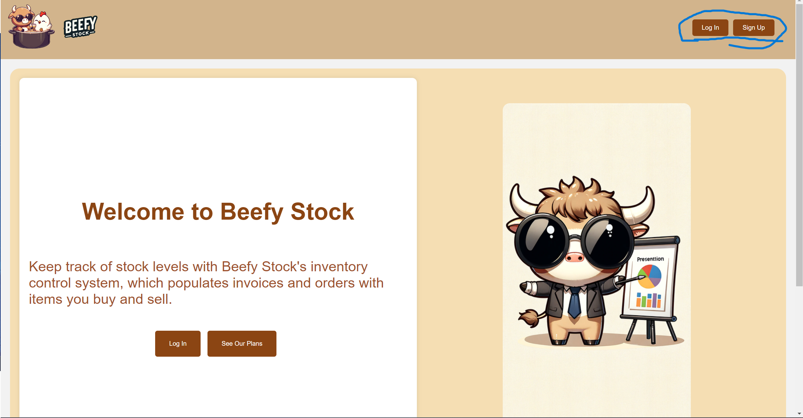
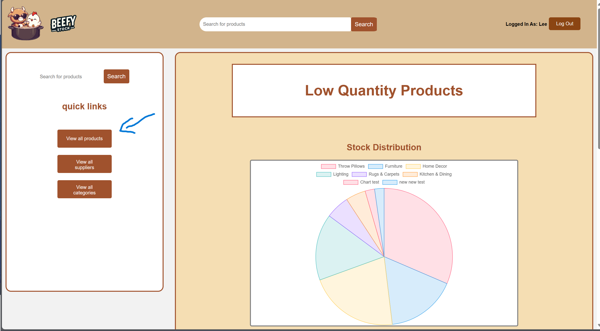
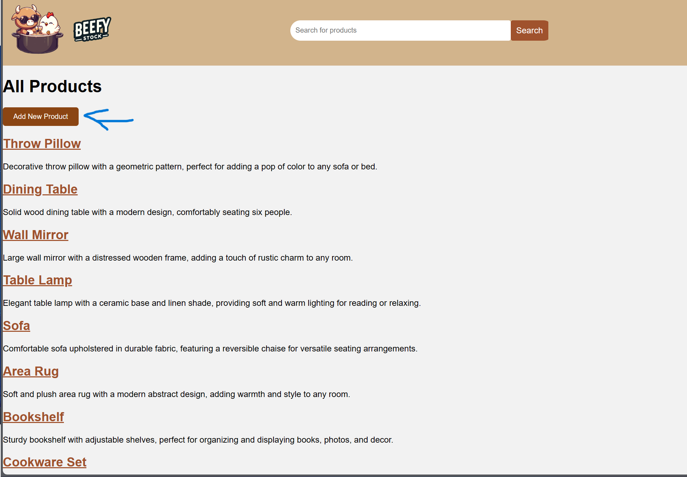

# BEEFY STOCK

## Description
Introducing our all-in-one solution for easy inventory management. Track, manage and optimise your inventory effortlessly. Whether you’re a small business or a large company, our website saves you time, money and stress. 
Our team created beefy stock to appeal to influencers, dropshippers and side hustlers as an attractive and more mainstream way of handling your inventory. A large part of our product was branding and we felt as if we had to get this right to appeal to our audience

## Technologies 
### We used the following technologies in our web service:

Handlebars: We used Handlebars to generate HTML templates for our pages. We knew that we would need many pages of the same type for our product views and search results so this module was perfect for the job

Postgres and Sequelize: We used sql databases and postgres to create the database, store our data and create a server on our local machine to view and test the website. Sequelize made creating our data and querying our databases easier with it’s built in functions

Sessions and validation. We created sessions to keep users logged in and added log in validations and bcrypt to keep the log in data entered suitable and safe

Chart.js: This acted as our new experimental technology. It’s a framework that allowed us to create charts ranging from pie, line, bar, scatter and more

## Installation
Visit the link here to view our website: https://beefy-stock.onrender.com/

Sometimes the link may not work as I use the database for another project. In this case the repo is able to be cloned and a postgres database created. You can find the commands for seeding the database and running the server within the package.json file

## Usage
Once you have the website open simply create an account and you will be greeted with an empty dashboard. From there you can begin to add products through our view all products section and watch the site come to life with in depth product views and fancy pie charts

## Credits
@Ali-mo12001: https://github.com/Ali-mo12002
@isazafeer: https://github.com/isazafeer
@Shemaalnn: https://github.com/shemaalnn

## License
n/a

## Contributing
n/a

## Tests
n/a

## Questions
for any questions you can reach me at: leewheeler123@gmail.com 

or visit my github profile: github.com/LWSE13
